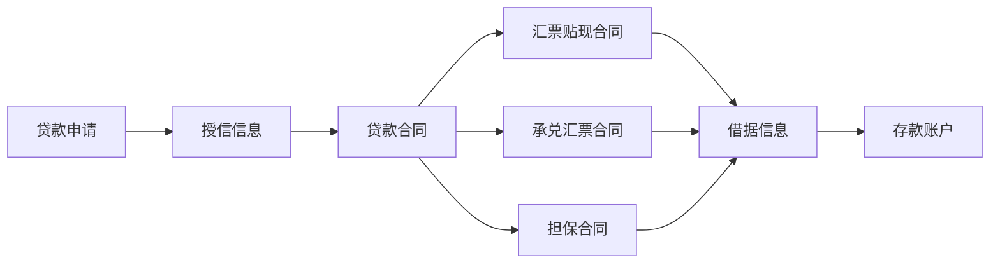

[TOC]

# 4 金融知识

## 4.1 未形成结构化的知识点

- 每一个用户开户时都会创建一个活期账号，之后每存一个定期都会生成一个定期账号，从定期账号中生成的利息都会存到对应的活期账号中。
- 负债科目 借减少，贷增长； 资产科目 借增长，贷减少
- 表内表外？？
- 有借必有贷，借贷必相等
- 在负债模型中借贷标记为借时意味着发生交易流水的账户减少了对应的发生额，发生额字段的数字永远是>=0的，而并不是通过存储正负数判断是不是增加或是减少
- 贷款

👆这个地方如果显示的不是树图去安装 [Github + mermaid](https://github.com/BackMarket/github-mermaid-extension)

## 4.2 银行业务

节选自 [银行业务_百度百科](https://baike.baidu.com/item/%E9%93%B6%E8%A1%8C%E4%B8%9A%E5%8A%A1/9856288?fr=aladdin#2)

按照其资产负债表的构成，银行业务主要分为三类：负债业务、资产业务、中间业务。

### 4.2.1 负债业务简介

负债业务是商业银行通过对外负债方式筹措日常工作所需资金的活动。

主要构成：
- 自有资本
- 存款负债
- 借款负债

其中存款和借款属于吸收的外来资金
另外联行存款、同业存款、借入或拆入款项或发行债券等，也构成银行的负债。

负债是银行由于授信而承担的将以资产或资本偿付的能以货币计量的债务。存款、派生存款是银行的主要负债，约占资金来源的80%以上
  
### 4.2.2 资产业务简介

资产业务，是指商业银行运用资金的业务，也就是商业银行将其吸收的资金贷放或投资出去赚取收益的活动。

主要构成：
- 储备资产
- 信贷资产
- 投资业务
- 放款业务

其中以贷款和投资最为重要。

### 4.2.3 中间业务简介

中间业务，是指商业银行代理客户办理收款、付款和其他委托事项而收取手续费的业务。银行不需动用自己的资金，依托业务、技术、机构、信誉和人才等优势，以中间人的身份代理客户承办收付和其他委托事项，提供各种金融服务并据以收取手续费的业务。银行经营中间业务无须占用自己的资金，是在银行的资产负债信用业务的基础上产生的，并可以促使银行信用业务的发展和扩大。

主要构成：
- 支付结算业务
- 银行卡业务
- 代理业务
- 担保及承诺
- 交易类业务
- 投资银行业务
- 基金托管业务
- 咨询顾问业务
- 其他中间业务

## 4.3 表外业务和表内业务

- 表内业务是指资产负债表中，资产和负债栏目可以揭示的业务:例如贷款、贸易融资、票据融资、融资租赁、透支、各项垫款等。
- 表外业务是指资产负债表不能揭示的业务，例如保证、银行承兑汇票等。

### 4.3.1 区别

1. 概念不同
  - 表外业务是指商业银行从事的，按照现行的会计准则不计入资产负债表内，不形成现实资产负债，但能够引起当期损益变动的业务。
  - 表内业务是指计入资产负债表中，形成现实资产负债。例如贷款、贸易融资、融资租赁、透支、各项垫款等。

2. 风险不同
  - 表外业务的风险在承诺和或有债权的活动，表外业务会使银行承受一定的额外风险。
  - 表内业务的风险体现在计提和损失本金的承担。

3. 业务不同
  - 表外业务的业务为结算业务不涉及资产负债。
  - 表内业务的业务为贷款和存款涉及银行资产和负债。