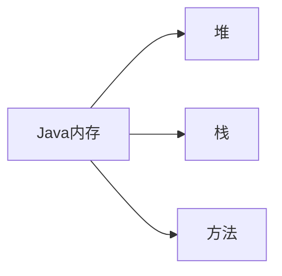

# 2. 反射

## 2.1 注解

### 2.1.1 简介

Annotation 从JDK5.0开始引入的新技术

注解与注释的用处相符，都可以对程序做出解释，但是注解是可以被其他程序（如编译器）读取到的。同样注解也有 __检查和约束__ 的作用

注解的用法是在对应的方法，属性，类的上方使用，注解一般以 __@__ 开头，比如最常见的 `@Override `

### 2.1.2 内置注解

- `@Override` : 定义在 java.lang.Override 中，修辞方法的，表示一个方法重写了父类方法
- `@Deprecated` : 定义在 java.lang.Deprecated 中，修辞方法、属性、类，表示不鼓励程序员使用这样的元素，通常是因为它很危险或存在更好的选择。通俗来说就是遗弃。
- `@SuppressWarnings` : 定义在 java.lang.SuppressWarnings 中，用来抑制编译时的警告信息。

其中 `@SuppressWarnings` 注解是需要添加一个参数才可以使用，参数包括

> ---
>  一个参数的语法 @SuppressWarnings("all")，
>  多个参数的语法 @SuppressWarnings(value={"all","path"})
>
> - deprecation:使用了过时的类或方法的警告
> - unchecked：执行了未检查时的转换时的警告，集合就是未指定泛型
> - fall through:当在switch语句使用时发生case穿透
> - path:在类路径、源文件路径等中有不存在路径的警告
> - serial:可序列化类上缺少serialVerisonUID定义时的警告
> - finally:任何finally橘子不能完成时的警告
> - all：以上所有情况的警告。
> ---

### 2.1.3 元注解

元注解的作用就是负责 __注解其他的注解__ ，Java一共定义了四个标准的元注解类型

- `@Target` : 用于描述注解的适用范围
- `@Retention` : 表示需要在什么级别保存该注释信息，用于描述注解的生命周期 （SOURCE < CLASS < RUNTIME）
- `@Document` : 说明该注解将被包含在 javadoc 中
- `@Inherited` : 说明子类可以继承父类中的该注解

```java
//自定义注解
public class TestAnno {
    @MyAnnotation
    public void test() {}
}

@Target(value = ElementType.METHOD)
@Retention(RetentionPolicy.RUNTIME)
@interface MyAnnotation {
    
}

```

### 2.1.4 自定义注解

使用@interface定义注解时会自动继承 `java.lang.annotation.Annotation`

注解体内每一个方法代表了一个 __参数__ ，方法名就是参数名，返回值类型就是参数类型（只能是基本类型，Class，Stirng，enum的其中一种）

同时可以通过default来生命默认值，如果只有一个参数，则参数名普遍为 __value__（因为在使用中value参数可以省略参数名）

```java
//自定义注解
public class TestAnno2 {
    @MyAnnotation2(name = "Hashqi", age = 3000, school={"a uni", "b uni"})
    public void test() {}

    @MyAnnotation3("aa")
    public void test2() {}
}

@Target(value = {ElementType.TYPE, ElementType.METHOD})
@Retention(RetentionPolicy.RUNTIME)
@interface MyAnnotation2 {
    //注解参数
    String name() default "";
    int age() default 0;
    int id() default -1;

    String[] schools();
}
@interface MyAnnotation3 {
    //注解参数
    int value();
}

```

## 2.2 反射机制

### 2.2.1 概述

反射机制主要是用来解决Java本身是静态语言，进而无法在运行时更改其结构的问题。

```javascript
//javascript
function f() {
    var x = "var a=3; var b=5; alert(a+b);";
    eval(x);
    alert(x);
}
```

像 javascript 语言就是动态语言，在运行时代码可以根据某些条件改变自身结构。

但是引入反射机制可以将Java变成准静态语言，但是会影响一些性能（虽然性能要比正常情况慢几十倍，但是由于如今的处理器性能发展迅速，反射所影响的性能变得微乎其微）

Reflection（反射）是Java被视作 __动态语言__ 的关键，反射机制允许程序在执行期间借助于 __Reflection API__ 取得任何类的内部信息,并能直接操作任意对象的内部属性以及方法。

```java
    Class c = Class.forName("java.lang.String");
```

### 2.2.2 主要API

加载完类之后，在堆内存的方法区中就产生了一个Class类型的对象（`Object.getClass()` 方法可以获取）

 `getClass()` 方法的返回类型就是 `java.lang.Class`。同样，类内部的方法，属性和构造器分别为：

- `java.lang.reflect.Method` 
- `java.lang.reflect.Field` 
- `java.lang.reflect.Constructor` 

### 2.2.3  反射示例

```java
package com.test;

public class TestReflect1 {
    public static void main(String[] args) {
        Class c1 = Class.forName("com.test.User");
        sout(c1); //输出：class com.test.User
        
        Class c2 = Class.forName("com.test.User");
        Class c3 = Class.forName("com.test.User");
        Class c4 = Class.forName("com.test.User");

        //一个类在内存中只有一个Class对象，一个类被加载后类的整个类的结构都被封装在Class对象中
        sout(c2.hashCode());
        sout(c3.hashCode());
        sout(c4.hashCode());
    }

}

class User{
    private String name;
    private int id;
    private int age;

    public User(String name, int id, int age){
        ...
    }

    getter...
    setter...

}
```

## 2.3 Class类

对象得到的信息：某个类的属性， 方法和构造器，某个类到底实现了哪些接口。对于每个类而言，JRE都为其保留了一个不变的Class类型的对象。一个Class对象包含了特定某个结构的基本信息。

- Class本身也是一个类
- Class对象只能由系统建立
- 一个加载的类在JVM中只能有一个Class实例
- 一个Class对象对应的是一个加载到JVM的一个.class文件
- 每个类的实例都会记得自己是由哪个Class实例生成的
- 通过Class可以完整的得到一个类中所有被加载的结构
- Class类是Reflection的根源，针对任何你想动态加载，运行的类，唯有现获得相应的Class对象

### 2.3.1 Class的常用方法

| 方法名 | 功能说明 |
| ---- | ---- |
| getName() | 返回String形式的该类的名称。 | 
| newInstance() | 根据某个Class对象产生其对应类的实例，它调用的是此类的默认构造方法(没有默认无参构造器会报错) | 
| getClassLoader() | 返回该Class对象对应的类的类加载器。 | 
| getSuperClass() | 返回某子类所对应的直接父类所对应的Class对象 | 
| isArray() | 判定此Class对象所对应的是否是一个数组对象 | 
| getComponentType()  | 如果当前类表示一个数组，则返回表示该数组组件的 Class 对象，否则返回 null。 | 
| getConstructor(Class[])  | 返回当前 Class 对象表示的类的指定的公有构造子对象。 | 
| getConstructors()  | 返回当前 Class 对象表示的类的所有公有构造子对象数组。 | 
| getDeclaredConstructor(Class[])  | 返回当前 Class 对象表示的类的指定已说明的一个构造子对象。 | 
| getDeclaredConstructors()  | 返回当前 Class 对象表示的类的所有已说明的构造子对象数组。 | 
| getDeclaredField(String)  | 返回当前 Class 对象表示的类或接口的指定已说明的一个域对象。 | 
| getDeclaredFields()  | 返回当前 Class 对象表示的类或接口的所有已说明的域对象数组。 | 
| getDeclaredMethod(String, Class[])  | 返回当前 Class 对象表示的类或接口的指定已说明的一个方法对象。 | 
| getDeclaredMethods()  | 返回 Class 对象表示的类或接口的所有已说明的方法数组。 | 
| getField(String)  | 返回当前 Class 对象表示的类或接口的指定的公有成员域对象。 | 
| getFields()  | 返回当前 Class 对象表示的类或接口的所有可访问的公有域对象数组。 | 
| getInterfaces()  | 返回当前对象表示的类或接口实现的接口。 | 
| getMethod(String, Class[])  | 返回当前 Class 对象表示的类或接口的指定的公有成员方法对象。 | 
| getMethods()  | 返回当前 Class 对象表示的类或接口的所有公有成员方法对象数组，包括已声明的和从父类继承的方法。 | 
| isInstance(Object)  | 此方法是 Java 语言 instanceof 操作的动态等价方法。 | 
| isInterface()  | 判定指定的 Class 对象是否表示一个接口类型 | 
| isPrimitive()  | 判定指定的 Class 对象是否表示一个 Java 的基类型。 | 
| newInstance()  | 创建类的新实例 | 

### 2.3.2 获取Class类实例的方法

1. 若已知具体的类，通过类的class属性获取，该方法安全可靠，性能最高

```java
Class clazz = Person.class;
```

2. 已知某个类的实例，调用该实例的 `getClass()` 方法获取Class对象

```java
Class clazz = person.getClass();
```

3. 已知某个类的全类名，且该类在类路径下，可以通过Class类的静态方法 `forName()` 获取

```java
Class clazz = CLass.forName("com.demo.Person");
```

4. 基本内置类型的包装类都有一个Type属性

```java
Class clazz = Integer.TYPE;
```

同样，可以通过一下方法获取Class对应父类的方法

```java
Class clazz = student.getSuperclass();
``` 

### 2.3.3 Class对象都存在于哪

- class：外部类，成员（成员内部类，静态内部类），局部内部类，匿名内部类
- interface：接口
- []：数组
- enum：枚举
- annotation：注解@interface
- primitive type：基本数据类型
- void 

其中，值得注意的是，数组的长度不同时，获取到的Class实例也是相同的,但是数组维度不同就不是相同的Class实例

```java
int[] a = new int[10];
int[] b = new int[100];
int[][] c = new int[10][10];

sout(a.getClass().hashCode());
sout(b.getClass().hashCode());
sout(c.getClass().hashCode());
```

### 2.3.4 内存分析



堆：

> 可以存放new的对象和数组
> 可以被所有的线程共享，不会存放别的对象引用

栈：

> 存放基本变量类型（会包含这个基本类型的具体数值）
> 引用对象的变量（会存放这个引用在堆里面的具体地址）

方法区：

> 可以被所有的线程共享
> 包含了所有的class和static的变量