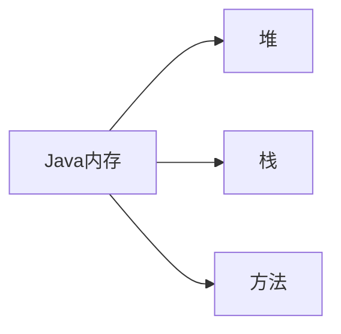

# 2. 反射

## 2.1 注解

### 2.1.1 简介

Annotation 从JDK5.0开始引入的新技术

注解与注释的用处相符，都可以对程序做出解释，但是注解是可以被其他程序（如编译器）读取到的。同样注解也有 __检查和约束__ 的作用

注解的用法是在对应的方法，属性，类的上方使用，注解一般以 __@__ 开头，比如最常见的 `@Override `

### 2.1.2 内置注解

- `@Override` : 定义在 java.lang.Override 中，修辞方法的，表示一个方法重写了父类方法
- `@Deprecated` : 定义在 java.lang.Deprecated 中，修辞方法、属性、类，表示不鼓励程序员使用这样的元素，通常是因为它很危险或存在更好的选择。通俗来说就是遗弃。
- `@SuppressWarnings` : 定义在 java.lang.SuppressWarnings 中，用来抑制编译时的警告信息。

其中 `@SuppressWarnings` 注解是需要添加一个参数才可以使用，参数包括

> ---
>  一个参数的语法 @SuppressWarnings("all")，
>  多个参数的语法 @SuppressWarnings(value={"all","path"})
>
> - deprecation:使用了过时的类或方法的警告
> - unchecked：执行了未检查时的转换时的警告，集合就是未指定泛型
> - fall through:当在switch语句使用时发生case穿透
> - path:在类路径、源文件路径等中有不存在路径的警告
> - serial:可序列化类上缺少serialVerisonUID定义时的警告
> - finally:任何finally橘子不能完成时的警告
> - all：以上所有情况的警告。
> ---

### 2.1.3 元注解

元注解的作用就是负责 __注解其他的注解__ ，Java一共定义了四个标准的元注解类型

- `@Target` : 用于描述注解的适用范围
- `@Retention` : 表示需要在什么级别保存该注释信息，用于描述注解的生命周期 （SOURCE < CLASS < RUNTIME）
- `@Document` : 说明该注解将被包含在 javadoc 中
- `@Inherited` : 说明子类可以继承父类中的该注解

```java
//自定义注解
public class TestAnno {
    @MyAnnotation
    public void test() {}
}

@Target(value = ElementType.METHOD)
@Retention(RetentionPolicy.RUNTIME)
@interface MyAnnotation {
    
}

```

### 2.1.4 自定义注解

使用@interface定义注解时会自动继承 `java.lang.annotation.Annotation`

注解体内每一个方法代表了一个 __参数__ ，方法名就是参数名，返回值类型就是参数类型（只能是基本类型，Class，Stirng，enum的其中一种）

同时可以通过default来生命默认值，如果只有一个参数，则参数名普遍为 __value__（因为在使用中value参数可以省略参数名）

```java
//自定义注解
public class TestAnno2 {
    @MyAnnotation2(name = "Hashqi", age = 3000, school={"a uni", "b uni"})
    public void test() {}

    @MyAnnotation3("aa")
    public void test2() {}
}

@Target(value = {ElementType.TYPE, ElementType.METHOD})
@Retention(RetentionPolicy.RUNTIME)
@interface MyAnnotation2 {
    //注解参数
    String name() default "";
    int age() default 0;
    int id() default -1;

    String[] schools();
}
@interface MyAnnotation3 {
    //注解参数
    int value();
}

```

## 2.2 反射机制

### 2.2.1 概述

反射机制主要是用来解决Java本身是静态语言，进而无法在运行时更改其结构的问题。

```javascript
//javascript
function f() {
    var x = "var a=3; var b=5; alert(a+b);";
    eval(x);
    alert(x);
}
```

像 javascript 语言就是动态语言，在运行时代码可以根据某些条件改变自身结构。

但是引入反射机制可以将Java变成准静态语言，但是会影响一些性能（虽然性能要比正常情况慢几十倍，但是由于如今的处理器性能发展迅速，反射所影响的性能变得微乎其微）

Reflection（反射）是Java被视作 __动态语言__ 的关键，反射机制允许程序在执行期间借助于 __Reflection API__ 取得任何类的内部信息,并能直接操作任意对象的内部属性以及方法。

```java
    Class c = Class.forName("java.lang.String");
```

### 2.2.2 主要API

加载完类之后，在堆内存的方法区中就产生了一个Class类型的对象（`Object.getClass()` 方法可以获取）

 `getClass()` 方法的返回类型就是 `java.lang.Class`。同样，类内部的方法，属性和构造器分别为：

- `java.lang.reflect.Method` 
- `java.lang.reflect.Field` 
- `java.lang.reflect.Constructor` 

### 2.2.3  反射示例

```java
package com.test;

public class TestReflect1 {
    public static void main(String[] args) {
        Class c1 = Class.forName("com.test.User");
        sout(c1); //输出：class com.test.User
        
        Class c2 = Class.forName("com.test.User");
        Class c3 = Class.forName("com.test.User");
        Class c4 = Class.forName("com.test.User");

        //一个类在内存中只有一个Class对象，一个类被加载后类的整个类的结构都被封装在Class对象中
        sout(c2.hashCode());
        sout(c3.hashCode());
        sout(c4.hashCode());
    }

}

class User{
    private String name;
    private int id;
    private int age;

    public User(String name, int id, int age){
        ...
    }

    getter...
    setter...

}
```

## 2.3 Class类

对象得到的信息：某个类的属性， 方法和构造器，某个类到底实现了哪些接口。对于每个类而言，JRE都为其保留了一个不变的Class类型的对象。一个Class对象包含了特定某个结构的基本信息。

- Class本身也是一个类
- Class对象只能由系统建立
- 一个加载的类在JVM中只能有一个Class实例
- 一个Class对象对应的是一个加载到JVM的一个.class文件
- 每个类的实例都会记得自己是由哪个Class实例生成的
- 通过Class可以完整的得到一个类中所有被加载的结构
- Class类是Reflection的根源，针对任何你想动态加载，运行的类，唯有现获得相应的Class对象

### 2.3.1 Class的常用方法

| 方法名 | 功能说明 |
| ---- | ---- |
| getName() | 返回String形式的该类的名称。 | 
| newInstance() | 根据某个Class对象产生其对应类的实例，它调用的是此类的默认构造方法(没有默认无参构造器会报错) | 
| getClassLoader() | 返回该Class对象对应的类的类加载器。 | 
| getSuperClass() | 返回某子类所对应的直接父类所对应的Class对象 | 
| isArray() | 判定此Class对象所对应的是否是一个数组对象 | 
| getComponentType()  | 如果当前类表示一个数组，则返回表示该数组组件的 Class 对象，否则返回 null。 | 
| getConstructor(Class[])  | 返回当前 Class 对象表示的类的指定的公有构造子对象。 | 
| getConstructors()  | 返回当前 Class 对象表示的类的所有公有构造子对象数组。 | 
| getDeclaredConstructor(Class[])  | 返回当前 Class 对象表示的类的指定已说明的一个构造子对象。 | 
| getDeclaredConstructors()  | 返回当前 Class 对象表示的类的所有已说明的构造子对象数组。 | 
| getDeclaredField(String)  | 返回当前 Class 对象表示的类或接口的指定已说明的一个域对象。 | 
| getDeclaredFields()  | 返回当前 Class 对象表示的类或接口的所有已说明的域对象数组。 | 
| getDeclaredMethod(String, Class[])  | 返回当前 Class 对象表示的类或接口的指定已说明的一个方法对象。 | 
| getDeclaredMethods()  | 返回 Class 对象表示的类或接口的所有已说明的方法数组。 | 
| getField(String)  | 返回当前 Class 对象表示的类或接口的指定的公有成员域对象。 | 
| getFields()  | 返回当前 Class 对象表示的类或接口的所有可访问的公有域对象数组。 | 
| getInterfaces()  | 返回当前对象表示的类或接口实现的接口。 | 
| getMethod(String, Class[])  | 返回当前 Class 对象表示的类或接口的指定的公有成员方法对象。 | 
| getMethods()  | 返回当前 Class 对象表示的类或接口的所有公有成员方法对象数组，包括已声明的和从父类继承的方法。 | 
| isInstance(Object)  | 此方法是 Java 语言 instanceof 操作的动态等价方法。 | 
| isInterface()  | 判定指定的 Class 对象是否表示一个接口类型 | 
| isPrimitive()  | 判定指定的 Class 对象是否表示一个 Java 的基类型。 | 
| newInstance()  | 创建类的新实例 | 

### 2.3.2 获取Class类实例的方法

1. 若已知具体的类，通过类的class属性获取，该方法安全可靠，性能最高

```java
Class clazz = Person.class;
```

2. 已知某个类的实例，调用该实例的 `getClass()` 方法获取Class对象

```java
Class clazz = person.getClass();
```

3. 已知某个类的全类名，且该类在类路径下，可以通过Class类的静态方法 `forName()` 获取

```java
Class clazz = CLass.forName("com.demo.Person");
```

4. 基本内置类型的包装类都有一个Type属性

```java
Class clazz = Integer.TYPE;
```

同样，可以通过一下方法获取Class对应父类的方法

```java
Class clazz = student.getSuperclass();
``` 

### 2.3.3 Class对象都存在于哪

- class：外部类，成员（成员内部类，静态内部类），局部内部类，匿名内部类
- interface：接口
- []：数组
- enum：枚举
- annotation：注解@interface
- primitive type：基本数据类型
- void 

其中，值得注意的是，数组的长度不同时，获取到的Class实例也是相同的,但是数组维度不同就不是相同的Class实例

```java
int[] a = new int[10];
int[] b = new int[100];
int[][] c = new int[10][10];

sout(a.getClass().hashCode());
sout(b.getClass().hashCode());
sout(c.getClass().hashCode());
```

## 2.4 内存分析



堆：可以存放new的对象和数组,可以被所有的线程共享，不会存放别的对象引用

栈：存放基本变量类型（会包含这个基本类型的具体数值）,引用对象的变量（会存放这个引用在堆里面的具体地址）

方法区：可以被所有的线程共享,包含了所有的class和static的变量,方法区属于特殊的堆

### 2.4.1 类的加载过程


__类的加载__： 将class文件读入内存，并将这些静态数据转换秤方法区的运行时数据结构。然后创建生成一个代表这个类的 `java.lang.Class` 对象。并将这些静态数据转换秤方法区的运行时数据结构。此过程由类加载器完成。

__类的链接__：将类的二进制数据合并到JVM的运行状态之中的过程，在此流程经过了三个步骤
- __验证__：确保加载的类信息符合JVM规范，没有安全方面的问题
- __准备__：正式为类变量分配内存并设置类变量初始默认值的阶段，这些内存都将在方法区中进行分配。
- __解析__：虚拟机内常量池内的符号引用（常量名）替换为直接引用（地址）的过程。

__类的初始化__：JVM负责对类进行初始化。时执行类构造器 `<client>()` 方法的过程。类构造器 `<client>()` 方法是由编译期自动收集类中所有类变量的赋值动作和静态代码块中的语句合并生成的。（类构造器是构造类信息的，不是构造该类对象的构造器）但是如果当一个类初始化时，其父类没有被加载，那么会优先触发其父类的初始化。虚拟机会保证一个类的 `<client>()` 方法在多线程环境中被正确加锁和同步

### 2.4.2 什么时候会发生类初始化

类的主动引用（一定会发生类的初始化）

- 当虚拟机启动时先初始化main方法所在的类
- new一个类的对象
- 调用类的静态成员（除了final常量）和静态方法
- 使用java.lang.reflect包的方法对类进行反射调用
- 初始化其类的子类，但是本身却没有被初始化时

类的被动引用（不会发生类的初始化）

- 当访问一个静态域时，只有真正生命这个域的类才会被初始化。如：当通过子类引用父类的静态变量，不会导致子类初始化
- 通过数组定义类引用，不会触发此类的初始化
- 引用常量不会触发此类的初始化

```java
// 可以猜猜最后会输出什么
public class Demo2 {
    public static void main(String[] args) {
        System.out.println(Student.name);
    }
}


class Person {
    static {
        System.out.println("Person.static");
    }

    public Person() {
        System.out.println("Person.Constructor");
    }

    static String name = "aaa";
}

class Student extends Person {
    static {
        System.out.println("Student.static");
    }

    public Student() {
        System.out.println("Student.Constructor");
    }

}
```

### 2.4.3 类加载器的作用

类加载的作用：将class文件字节码内容加载到内存中，并将这些静态数据转换秤方法区的运行时数据结构。然后创建生成一个代表这个类的 `java.lang.Class` 对象。

类缓存：标准的JavaSE类加载器可以按照要求查找类，一旦某个类被加载到类加载器中，他将维持加载一段时间，不过JVM垃圾回收机制可以回收这些Class对象。

## 2.5 创建运行时类的对象

### 2.5.1 通过反射获取运行时完整的对象

```java
package com;

import java.lang.reflect.Field;

public class Demo2 {
    public static void main(String[] args) {
        try {
            Class clazz = Class.forName("com.Student");
            Field[] fs = clazz.getFields();     //获取本类以及其父类的所有public属性
            for (Field f : fs) {
                System.out.println(f);
            }
            System.out.println("====================");
            fs = clazz.getDeclaredFields();     //只获取本类的所有属性
            for (Field f : fs) {
                System.out.println(f);
            }

            //直接获取对象中测属性值
            fs[0].setAccessible(true);//如果想获取或者设置private修饰的属性，请先运行这行代码关闭权限检测
            Student s = new Student();
            System.out.println(fs[0].get(s));
            fs[0].set(s, "s");
            System.out.println(fs[0].get(s));

        } catch (ClassNotFoundException e) {
            e.printStackTrace();
        }catch (IllegalAccessException e) {
            e.printStackTrace();
        }
    }
}


class Person {
    public static String name1 = "name1";
    private static String name2 = "name2";
    public String sex = "male";
    private int age = 0;
}

class Student extends Person {
    static String name3 = "name3333";
    private String addr = "addr";
    public String tel = "18800000000";
}

/*
输出：
public java.lang.String com.Student.tel
public static java.lang.String com.Person.name1
public java.lang.String com.Person.sex
====================
static java.lang.String com.Student.name3
private java.lang.String com.Student.addr
public java.lang.String com.Student.tel
name3333
s
*/

```


```java
package com;

import java.lang.reflect.Constructor;
import java.lang.reflect.Field;
import java.lang.reflect.Method;

public class Demo2 {
    public static void main(String[] args) {
        try {
            //获取全部方法
            Class clazz = Class.forName("com.Student");
            Method[] fs = clazz.getMethods();
            for (Method f : fs) {
                System.out.println(f);
            }
            System.out.println("====================================");
            fs = clazz.getDeclaredMethods();
            for (Method f : fs) {
                System.out.println(f);
            }

            System.out.println("====================================");
            //获取指定方法
            Method m2 = clazz.getMethod("m2", null);
            Method m6 = clazz.getMethod("m6", String.class);

            System.out.println(m2);
            System.out.println(m6);

            //这一条因为找不到对应方法会抛出异常
            //Method m1 = clazz.getMethod("m1", null);

            System.out.println("====================================");
            //获得全部构造器
            Constructor[] constructors = clazz.getConstructors();
            for (Constructor constructor : constructors) {
                System.out.println(constructor);
            }
            System.out.println("====================================");
            constructors = clazz.getDeclaredConstructors();
            for (Constructor constructor : constructors) {
                System.out.println(constructor);
            }

            //获得指定构造器

            Constructor constructor = clazz.getConstructor(null);

        } catch (ClassNotFoundException e) {
            e.printStackTrace();
        } catch (NoSuchMethodException e) {
            e.printStackTrace();
        }
    }
}


class Person {
    public Person() {
        System.out.println("Person.Constructor");
    }
    private static void m1(){};
    public static void m2(){};
    private void m3(){};
    public void m4(){};
}

class Student extends Person {
    public Student() {
        System.out.println("Student.Constructor");
    }
    private void m5(){};
    public void m6(String s1){};
}

```

### 2.5.2 创建并调用类的对象

```java
package com;

import java.lang.reflect.Constructor;
import java.lang.reflect.Field;
import java.lang.reflect.InvocationTargetException;
import java.lang.reflect.Method;

public class Demo2 {
    public static void main(String[] args) {
        try {
            Class clazz = Class.forName("com.Student");

            //clazz.newInstance()从Java9之后就不再推荐使用，而是改用以下方法
            Student student = (Student)clazz.getDeclaredConstructor(null).newInstance();
            System.out.println(student);
            //传参构造函数
            student = (Student)clazz
                    .getDeclaredConstructor(String.class)
                    .newInstance("Hashqi");
            System.out.println(student);

            // 获取并调用方法
            Method getName = clazz.getDeclaredMethod("getName", null);
            Method setName = clazz.getDeclaredMethod("setName", String.class);

            System.out.println(getName.invoke(student));
            setName.invoke(student, "Hashqi...");
            System.out.println(getName.invoke(student));

            

        } catch (ClassNotFoundException | NoSuchMethodException e) {
            e.printStackTrace();
        } catch (IllegalAccessException e) {
            e.printStackTrace();
        } catch (InstantiationException e) {
            e.printStackTrace();
        } catch (InvocationTargetException e) {
            e.printStackTrace();
        }
    }
}


class Person {
    public Person() {
        System.out.println("Person.Constructor");
    }
}

class Student extends Person {
    public Student() {
        System.out.println("Student.Constructor");
    }
    public Student(String name) {
        this.name = name;
        System.out.println("Student.Constructor");
    }
    public String name;

    public String getName() {
        return name;
    }

    public void setName(String name) {
        this.name = name;
    }

    @Override
    public String toString() {
        return "Student{" +
                "name='" + name + '\'' +
                '}';
    }
}
```

`Method`,`Field`和`Constructor`对象都有`setAccessible(boolean)`方法,这个方法作用是启动和禁用访问安全检查的开关，也可以用来提高反射的效率。

## 2.6 反射操作泛型

Java采用泛型擦除的机制来引入泛型，Java中的泛型仅仅时给编译器javac使用的，确保数据的安全性和免去强制类型转换问题，但是一旦编译完成，所有和泛型有关的类型全部擦除

为了通过反射操作这些类型，Java新增了ParameterizedType， GenericArrayType， TypeVariable， WildcardType几种类型来代表不能被归一到Class类中类型但是又和原始类型齐名的类型。

- ParameterizedType：表示一种参数化类型 比如Collection<String>
- GenericArrayType：表示一种元素类型时参数化类型或者类型变量的数组类型
- TypeVariable：是各种类型变量的公共父接口
- WildcardType：代表一种通配符类型表达式

```java
package com;

import java.lang.reflect.*;
import java.util.List;
import java.util.Map;

public class Demo2 {
    public static void main(String[] args) throws NoSuchMethodException {

        //t01
        Method method = Demo2.class.getMethod("t01", Map.class, List.class);

        Type[] types = method.getGenericParameterTypes();

        for (Type type : types) {
            System.out.println(type);
            if(type instanceof ParameterizedType){
                Type[] b = ((ParameterizedType) type).getActualTypeArguments();
                for (Type type1 : b) {
                    System.out.println(type1);
                }
            }
        }


        //t02
        method = Demo2.class.getMethod("t02");
        Type genType = method.getGenericReturnType();
        if(genType instanceof ParameterizedType){
            Type[] b = ((ParameterizedType) genType).getActualTypeArguments();
            for (Type type1 : b) {
                System.out.println(type1);
            }
        }
    }

    public void t01(Map<String, Integer> map, List<Integer> list){

    }
    public Map<String, Integer> t02(){
        System.out.println("test02");
        return null;
    }
}
```

## 2.7 反射操作注解