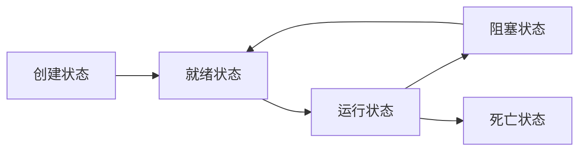

# Java 多线程

## Process 和 Thread

Process指进程，Thread指线程。

进程是指程序运行的过程，是一个动态的概念，也是一个系统分配资源的单位。

多个线程b可以在一个进程a内并行运行，并且属于a的线程b可以共享a内的资源，但同时也存在线程同步的问题。

单核CPU的情况下，微观上看一个时刻只能有一个线程再运行，只是CPU切换的过快使人感觉上是多线程并行运行。

## Java 线程创建的三个方法

```java

/*1. 继承Thread类*/

// 创建
public class MyThread extends Thread{
    //线程入口点
    @Override
    public void run(){
        //线程体
    }
} 

// 运行
public class Demo {
    public static void main (String[] args){
        MyThread myThread = new MyThread();
        myThread.start();
    }
} 

/*2. 实现Runnable接口*/

public class MyRunnable implements Runnable{
    //线程入口点
    @Override
    public void run(){
        //线程体
    }
}

// 运行
public class Demo {
    public static void main (String[] args){
        MyRunnable myRunnable = new MyRunnable();
        new Thread(myRunnable, "Hashqi").start();
    }
} 

/*3. 实现Callable接口*/

public class MyCallable implements Callable<T>{
    //线程入口点
    @Override
    public T call(){
        //线程体
        return t;
    }
}

// 运行
public class Demo {
    public static void main (String[] args){
        MyCallable myCallable1 = new MyCallable();
        MyCallable myCallable2 = new MyCallable();
        
        //创建执行服务
        ExecutorService ser = Executors.newFixedThreadPool(2);//参数代表有几个线程
        //提交执行
        Future<Boolean> res1 = ser.submit(myCallable1);
        Future<Boolean> res2 = ser.submit(myCallable2);
        //获取结果(get为阻塞方法)
        Boolean r1 = res1.get();
        Boolean r2 = res2.get();
        //关闭服务
        ser.shutdownNow();

    }
} 

```

1. 继承Thread类方法：
- 首先需要继承Thread类，即 extends Thread 。
- 然后重写run方法来制作线程体。
- 想要运行则需要 new MyThread() 后调用 myThread.start() 方法。

2. 实现Runnable接口方法:
- 首先需要实现Runnable接口，即 implements Runnable 。
- 然后重新run方法制作线程体。
- 运行则需要实现Thread时将Runnable的实现类作为参数放入到构造函数中，并运行start()方法。

3. 实现Callable接口方法:
- 首先需要实现Callable<T>，T为范类，代表返回值的类型。
- 然后重写返回类型为T的call方法。
- 运行方法需要创建服务，并提交callable实现类，通过get方法获取返回值。记得最终要关闭服务。

继承Thread类方法和实现Runnable接口方法作比较会发现Java有单继承的性质，从而使用Runnable接口方法不会占用父类的位置。
实现Callable接口方法可以获取返回值，但是获取返回值的函数是阻塞函数，如果进程没有结束则不会继续执行。

## 静态代理

本节主要讲解的是静态代理的设计模式和对于Java的代码实现

这里部分的知识点节选自 [常用设计模式有哪些？](https://refactoringguru.cn/design-patterns)

代理分为静态代理和动态代理，静态代理.

静态代理规定真实对象和代理对象要实现同一个接口（Marry），代理对象要代理真实角色。

好处：
- 代理对象可以做很多真实对象做不了的事情（before和after）
- 真实对象专注做自己的事情

```java
/** 假设某一家婚庆公司要代理你自己进行婚礼前后的准备，并让你参加婚礼
  * 此时你自己属于真实对象，而婚庆公司则属于代理对象
  * 代理对象需要完成婚礼前准备工作和婚礼后的收尾工作
  * 而真实对象只需要参加婚礼
  */

public class StaticProxy{
    public static void main(String[] args){
        WeddingCompany weddingCompany = new WeddingCompany(new You());
        weddingCompany.happyMarry();
    }
}

interface Marry{
    void happyMarry();
}

//真实角色
class You impelments Marry{
    @Override
    public void happyMarry(){
        System.out.println("You进行流程");
    }
}

//代理角色
class WeddingCompany implements Marry{

    private Marry target;

    //构造函数
    public WeddingCompany (Marry marry){
        this.target = marry;
    }

    @Override
    public void happyMarry(){
        before();
        this.target.happyMarry();   //代理运行真实对象的方法
        after();
    }
    public void before(){
        System.out.println("WeddingCompany流程前");
    }
    public void after(){
        System.out.println("WeddingCompany流程后");
    }
}

```

## 进程的五大状态

- 创建状态
- 就绪状态
- 阻塞状态
- 运行状态
- 死亡状态


👆这个地方如果显示的不是树图去安装 [Github + mermaid](https://github.com/BackMarket/github-mermaid-extension)