[TOC]

# 1 Java 多线程

## 1.1 Process 和 Thread

Process指进程，Thread指线程。

进程是指程序运行的过程，是一个动态的概念，也是一个系统分配资源的单位。

多个线程b可以在一个进程a内并行运行，并且属于a的线程b可以共享a内的资源，但同时也存在线程同步的问题。

单核CPU的情况下，微观上看一个时刻只能有一个线程再运行，只是CPU切换的过快使人感觉上是多线程并行运行。

## 1.2 Java 线程创建的三个方法

```java

/*1. 继承Thread类*/

// 创建
public class MyThread extends Thread{
    //线程入口点
    @Override
    public void run(){
        //线程体
    }
} 

// 运行
public class Demo {
    public static void main (String[] args){
        MyThread myThread = new MyThread();
        myThread.start();
    }
} 

/*2. 实现Runnable接口*/

public class MyRunnable implements Runnable{
    //线程入口点
    @Override
    public void run(){
        //线程体
    }
}

// 运行
public class Demo {
    public static void main (String[] args){
        MyRunnable myRunnable = new MyRunnable();
        new Thread(myRunnable, "Hashqi").start();
    }
} 

/*3. 实现Callable接口*/

public class MyCallable implements Callable<T>{
    //线程入口点
    @Override
    public T call(){
        //线程体
        return t;
    }
}

// 运行
public class Demo {
    public static void main (String[] args){
        MyCallable myCallable1 = new MyCallable();
        MyCallable myCallable2 = new MyCallable();
        
        //创建执行服务
        ExecutorService ser = Executors.newFixedThreadPool(2);//参数代表有几个线程
        //提交执行
        Future<Boolean> res1 = ser.submit(myCallable1);
        Future<Boolean> res2 = ser.submit(myCallable2);
        //获取结果(get为阻塞方法)
        Boolean r1 = res1.get();
        Boolean r2 = res2.get();
        //关闭服务
        ser.shutdownNow();

    }
} 

```

1. 继承Thread类方法：
- 首先需要继承Thread类，即 extends Thread 。
- 然后重写run方法来制作线程体。
- 想要运行则需要 new MyThread() 后调用 myThread.start() 方法。

2. 实现Runnable接口方法:
- 首先需要实现Runnable接口，即 implements Runnable 。
- 然后重新run方法制作线程体。
- 运行则需要实现Thread时将Runnable的实现类作为参数放入到构造函数中，并运行start()方法。

3. 实现Callable接口方法:
- 首先需要实现Callable<T>，T为范类，代表返回值的类型。
- 然后重写返回类型为T的call方法。
- 运行方法需要创建服务，并提交callable实现类，通过get方法获取返回值。记得最终要关闭服务。

继承Thread类方法和实现Runnable接口方法作比较会发现Java有单继承的性质，从而使用Runnable接口方法不会占用父类的位置。
实现Callable接口方法可以获取返回值，但是获取返回值的函数是阻塞函数，如果进程没有结束则不会继续执行。

## 1.3 静态代理

本节主要讲解的是静态代理的设计模式和对于Java的代码实现

这里部分的知识点节选自 [常用设计模式有哪些？](https://refactoringguru.cn/design-patterns)

代理分为静态代理和动态代理，静态代理.

静态代理规定真实对象和代理对象要实现同一个接口（Marry），代理对象要代理真实角色。

好处：
- 代理对象可以做很多真实对象做不了的事情（before和after）
- 真实对象专注做自己的事情

```java
/** 假设某一家婚庆公司要代理你自己进行婚礼前后的准备，并让你参加婚礼
  * 此时你自己属于真实对象，而婚庆公司则属于代理对象
  * 代理对象需要完成婚礼前准备工作和婚礼后的收尾工作
  * 而真实对象只需要参加婚礼
  */

public class StaticProxy{
    public static void main(String[] args){
        WeddingCompany weddingCompany = new WeddingCompany(new You());
        weddingCompany.happyMarry();
    }
}

interface Marry{
    void happyMarry();
}

//真实角色
class You impelments Marry{
    @Override
    public void happyMarry(){
        System.out.println("You进行流程");
    }
}

//代理角色
class WeddingCompany implements Marry{

    private Marry target;

    //构造函数
    public WeddingCompany (Marry marry){
        this.target = marry;
    }

    @Override
    public void happyMarry(){
        before();
        this.target.happyMarry();   //代理运行真实对象的方法
        after();
    }
    public void before(){
        System.out.println("WeddingCompany流程前");
    }
    public void after(){
        System.out.println("WeddingCompany流程后");
    }
}

```

## 1.4 进程的状态

### 1.4.1 进程五大状态

- 创建状态
- 就绪状态
- 阻塞状态
- 运行状态
- 死亡状态

```mermaid
graph LR
A[创建状态]
B[就绪状态]
C[阻塞状态]
D[运行状态]
E[死亡状态]
A-->B
B-->D
D-->B
D-->C
C-->B
D-->E
```


👆这个地方如果显示的不是图或者没有显示图请安装 [Github + mermaid](https://github.com/BackMarket/github-mermaid-extension)

### 1.4.2 查看线程的当前状态

Thread.State

| 名称 | 说明 | 
| ---- | ---- |
| NEW | 尚未启动的线程处于此状态 |
| RUNNABLE | 在Java虚拟机中执行的线程处于此状态 |
| BLOCKED | 被阻塞等待监视器锁定的线程处于此状态 |
| WAITING | 正在等待另一个线程执行特定动作的线程处于此状态 |
| TIMED_WAITING | 正在等待另一个线程执行动作达到指定等待时间的线程属于此状态 |
| TERMINATED | 已退出的线程处于此状态 |

```java
//NEW
Thread thread = new Thread();
Thread.State state = thread.getstate(); // 获取当前线程的状态（若后期线程改变，此变量不会改变）

//RUNNABLE
thread.start();
state = thread.getstate();

//TIMED_WAITING
//当线程执行到sleep()并处于阻塞状态时：
while(state != Thread.State.TIMED_WAITING){
    state = thread.getstate();
}

//TERMINATED
//当线程的执行结束时：
while(state != Thread.State.TERMINATED){
    state = thread.getstate();
}

//死亡后的线程不可以再次运行，会抛出IllegalThreadStateException异常
thread.start();

```


## 1.5 线程方法

### 1.5.1 线程的基础方法

| 方法 | 说明 |
| ---- | ---- |
| setPriority(int newPriority)  | 更改线程的优先级 |
| static void sleep(long millis)  | 在指定的毫秒数内让当前正在执行的线程休眠 |
| void join()  | 等待该线程终止 |
| static void yield()  | 暂停当前正在执行的线程对象并执行其他线程 |
| void interrupt()  | (不建议使用)中断线程 |
| boolean isAlive()  | 测试线程是否处于活动状态 |

### 1.5.2 停止进程

停止进程尽量不要使用JDK提供的stop()方法和destory()方法

```java
class TestStop implements Runnable {

    boolean flag = true;

    @Override
    public void run() {
        int i = 0;
        while(flag){
            //线程体
        }
    }

    public void stop() {
        this.flag = false;
    }

    public static void main(String[] args) {
        TestStop ts = new TestStop();

        new Thread(ts).start();

        for(int i = 0; i < 1000; i++){
            if(i = 900){
                ts.stop();
            }
        }
    }

}
```

### 1.5.3 进程休眠

sleep方法使进行阻塞设置的时间，并再次返回到就绪状态等待分配资源。sleep方法存在InterruptedException异常。
休眠方法的用法为：sleep(毫秒数)

### 1.5.4 线程礼让

yield方法用于当前正在执行的线程停止但不阻塞（就是将线程从运行状态转为就绪状态），但是是否礼让成功要取决于CPU的调度，同样也不一定会成功

### 1.5.5 线程合并

join方法可以合并线程，等待a线程结束之后再执行b线程，其他线程阻塞

```java

public class TestJoin implements Runnable {
    @Override
    public void run() {
        for(int i = 0; i < 100; i++){
            sout("vip : " + i);
        }    
    }

    public static void main(String[] args) {

        TestJoin tj = new TestJoin();
        Thread thread = new Thread(tj);
        thread.start();

        for(int i = 0; i < 1000; i++){
            sout("standard : " + i);
            if(i == 200){
                thread.join();      //200之前是并行输出，等到200后主线程阻塞，等tj跑完之后主线程才会继续跑
            }
        }    

    }
}
```

### 1.5.6 线程内获取线程信息

Thread.currentThread() //获取当前进程的对象
Thread.currentThread().getName() //获取名字
Thread.currentThread().getPriority() //获取优先级


## 1.6 线程优先级

Java提供一个线程调度器来监控程序中启动后进入就绪状态的所有线程，线程调度器按照优先级决应该调度哪个线程来执行。

线程的优先级用数字来表示，范围1~10

- Thread.MIN_PRIORITY = 1;
- Thread.MAX_PRIORITY = 10;
- Thread.NORM_PRIORITY = 5;

使用下面方式更改优先级

- getPriority().setPriority(int XXX);

优先级高的并不一定会优先运行。优先级高的优先运行的概率会变高。

## 1.7 守护线程

线程被分为用户线程和守护线程，虚拟机等待用户线程执行完毕，但不用等待守护线程执行完毕，也就是说如果只有守护线程，那么虚拟机会停止运行。

```java
public class TestDaemon {
    God god = new God();
    Human human = new Human(); 

    Thread tgod = new Thread(god);
    thread.setDaemon(true);     //设置为守护线程
    tgod.start();

    Thread thuman = new Thread(human);
    thuman.start();
}

//守护进程
class God implements Runnable {
    while(true) {
        sout("God alive");
    }
}

//用户进程
class Human implements Runnable {
    public void run() {
        for(int i = 0; i < 1000; i++){
            sout("Human alive");
        }   
        sout("Human dead");
    }
}
```

需要注意：

- thread.setDaemon(true)必须在thread.start()之前设置，否则会跑出一个IllegalThreadStateException异常。你不能把正在运行的常规线程设置为守护线程
- 在Daemon线程中产生的新线程也是Daemon的
- 守护线程不能用于去访问固有资源，比如读写操作或者计算逻辑。因为它会在任何时候甚至在一个操作的中间发生中断。
- Java自带的多线程框架，比如ExecutorService，会将守护线程转换为用户线程，所以如果要使用后台线程就不能用Java的线程池。

## 1.8 线程同步

### 1.8.1 线程同步

当多个线程操作同一个资源的时候会出现线程并发问题。即多个线程可能会同时修改同一个资源，这个时候就需要线程同步，线程同步其实是一种等待机制，需要形成队列等待前面线程使用完毕，下一个线程再使用。

线程同步的形成条件为： 队列 + 锁 （解决线程安全性） synchronized

但是线程同步存在某些问题：

- 加锁会导致影响性能
- 如果一个优先级高的线程等待优先级低的线程释放锁，就会导致优先级倒置，引起性能问题。

非安全列表

```java
public class UnSafeList {
    public static void main(String[] args) {
        List<String> list = new ArrayList<String>();
        
        for(int i = 0; i < 10000; i++){
            new Thread(() -> {              //lambda表达式
                list.add(Thread.currentThread().getName());
            }).start();
        }   

        Thread.sleep(3000);
        sout(list.size);
    }
}

```

安全列表
synchronized可以修饰方法，类和代码块
修饰方法时实际上是锁上了方法的所属对象
修饰代码块的部分又称作同步块

```java
public class SafeList {
    public static void main(String[] args) {
        List<String> list = new ArrayList<String>();
        
        for(int i = 0; i < 10000; i++){
            new Thread(() -> {              //lambda表达式
                synchronized(list) {        //同步块，锁的对象必须是需要同时访问的对象
                    list.add(Thread.currentThread().getName());
                }
            }).start();
        }   

        Thread.sleep(3000);
        sout(list.size);
    }
}

```

### 1.8.2 JUC简介

JUC是 java.util.concurrent 工具包的简称，这是一个处理线程的工具包，JDK 1.5开始出现的。

先简单举个例子

```java
import java.util.concurrent.*;

public class TestJUC {
    public static void main(String[] args) {
        CopyOnWriteArrayList<String> list = new CopyOnWriteArrayList<String>();

        for(int i = 0; i < 10000; i++){
            new Thread(() -> {
                list.add(Thread.currentThread().getName());
            }).start();
        }

        Thread.sleep(3000);
        sout(list.size);
    }
}
```

在上面程序中使用到了java.util.concurrent.CopyOnWriteArrayList这个类，他是写数组的拷贝，支持高效率并发且是线程安全的,读操作无锁的ArrayList。所有可变操作都是通过对底层数组进行一次新的复制来实现。

### 1.8.3 死锁

多个线程各自占有一些共享资源，并互相等待其他线程占有的资源才会运行，从而导致多个线程都在等待其他线程释放资源，最终停止执行的情况。

```java
public class DeadLock {
    Makeup girl1 = new Makeup(0, "girl1");
    Makeup girl2 = new Makeup(1, "girl2");

    girl1.start();
    girl2.start();
}

class Lipstick{

}

class Mirror{
    
}

class Makeup extends Thread{
    static Lipstick lipstick = new Lipstick();
    static Mirror mirror = new Mirror();

    int choice;
    String girlName;

    public Makeup(int choice, String girlName){
        this.choice = choice;
        this.girlName = girlName;
    }

    @Override
    public void run() {
        makeup();
    }

    private void makeup() {
        if(choice == 0) {
            synchronized(lipstick) {
                Thread.sleep(1000);
                synchronized(mirror) {
                    Thread.sleep(1000);
                }
            }
        }
        else {
            synchronized(mirror) {
                Thread.sleep(1000);
                synchronized(lipstick) {
                    Thread.sleep(1000);
                }
            }
        }
    }
}

```


产生死锁的四个必要的条件：

- 互斥条件： 一个资源每次最多只能被n-1个进程使用
- 请求与保持条件： 一个进程因请求资源而阻塞时对已获得的资源保持不放
- 不剥夺条件： 进程已获得的资源，在未使用完之前，不能强行剥夺。
- 循环等待条件：若干个进程之间形成一种头尾相接的循环等待资源关系。

### 1.8.4 Lock

Lock同步锁在JDK1.5之后出现，使得实现同步锁更加的灵活(Lock显式锁)。

Lock需要通过lock()方法上锁，通过unlock()方法释放锁。为了保证锁能释放，所有unlock方法一般放在finally中去执行。

Lock类同样也是JUC包下的工具类。

```java
public class TestLock {
    public static void main(String[] args) {
        Ticket td = new Ticket();
        new Thread(td, "窗口1").start();
        new Thread(td, "窗口2").start();
        new Thread(td, "窗口3").start();
    }
}

class Ticket implements Runnable {
    private Lock lock = new ReentrantLock();//创建lock锁
    private int ticket = 100;
    @Override
    public void run() {
        while (true) {
            lock.lock();//上锁
            try {
                if (ticket > 0) {
                    try {
                        Thread.sleep(200);
                    } catch (Exception e) {
                    }
                    System.out.println(Thread.currentThread().getName() + "完成售票，余票为：" + (--ticket));
                }
            }finally {
                lock.unlock();//释放锁
            }

        }
    }
}
```

值得注意的是，在1.8.2章节中使用过的CopyOnWriteArrayList类中也是使用ReentrantLock（Lock的实现类）锁进行同步操作。

### 1.8.5 JUC基础

摘抄自 [JUC-简书](https://www.jianshu.com/p/1f19835e05c0)

先来看看下面的一段代码：
```java
public class TestVolatile {
    public static void main(String[] args){ //这个线程是用来读取flag的值的
        ThreadDemo threadDemo = new ThreadDemo();
        Thread thread = new Thread(threadDemo);
        thread.start();
        while (true){
            if (threadDemo.isFlag()){
                System.out.println("主线程读取到的flag = " + threadDemo.isFlag());
                break;
            }
        }
    }
}

@Data
class ThreadDemo implements Runnable{ //这个线程是用来修改flag的值的
    public  boolean flag = false;
    @Override
    public void run() {
        try {
            Thread.sleep(200);
        } catch (InterruptedException e) {
            e.printStackTrace();
        }
        flag = true;
        System.out.println("ThreadDemo线程修改后的flag = " + isFlag());
    }
}
```

这段代码很简单，就是一个ThreadDemo类继承Runnable创建一个线程。它有一个成员变量flag为false，然后重写run方法，在run方法里面将flag改为true，同时还有一条输出语句。然后就是main方法主线程去读取flag。如果flag为true，就会break掉while循环，否则就是死循环。按道理，下面那个线程将flag改为true了，主线程读取到的应该也是true，循环应该会结束。

但是程序并没有结束，也就是死循环。说明主线程读取到的flag还是false，可是另一个线程明明将flag改为true了，而且打印出来了，这是什么原因呢？这就是内存可见性问题。

    内存可见性问题：当多个线程操作共享数据时，彼此不可见。

```java
while (true){
        synchronized (threadDemo){
            if (threadDemo.isFlag()){
                System.out.println("主线程读取到的flag = " + threadDemo.isFlag());
                break;
            }
        }
 }
```

使用 synchronized 代码块确实可以解决这个问题，但是一加锁，每次只能有一个线程访问，当一个线程持有锁时，其他的就会阻塞，效率就非常低了。不想加锁，又要解决内存可见性问题，那么就可以使用volatile关键字。

volatile 保证了不同线程对这个变量进行操作时的可见性，即一个线程修改了某个变量的值，这新值对其他线程来说是立即可见的。（实现可见性）

volatile关键字：当多个线程操作共享数据时，可以保证内存中的数据可见。用这个关键字修饰共享数据，就会及时的把线程缓存中的数据刷新到主存中去，也可以理解为，就是直接操作主存中的数据。所以在不使用锁的情况下，可以使用volatile。

```java
public  volatile boolean flag = false;
```

volatile和synchronized的区别在于volatile不具备互斥性和原子性。

对于解决原子性的相关问题，在JDK 1.5之后，Java提供了原子变量，在java.util.concurrent.atomic包下。原子变量具备如下特点：

- 有volatile保证内存可见性。
- 用CAS算法保证原子性。（CAS算法自行查询）

```java
 //private int i = 0;
 AtomicInteger i = new AtomicInteger();
 public int getI(){
     return i.getAndIncrement();
 }
```

## 1.9 线程协作

### 1.9.1 生产者消费者模式

生产者生产产品，消费者消费产品，如果生产者达到了存货上线，则不会再生产，消费者如果没有货物，同样也不需要消费。

在这个问题中，生产者和消费者共享同一个资源，并且两个线程之间相互依赖，互为条件

```java
public class TestProductorAndconsumer {
    public static void main(String[] args){
           Clerk clerk = new Clerk();
           Productor productor = new Productor(clerk);
           Consumer consumer = new Consumer(clerk);
           new Thread(productor,"生产者A").start();
           new Thread(consumer,"消费者B").start();
    }
}
//店员
class Clerk{
    private int product = 0;//共享数据
    public synchronized void get(){ //进货
        if(product >= 10){
            System.out.println("产品已满");
        }else {
            System.out.println(Thread.currentThread().getName()+":"+ (++product));
        }
    }
    public synchronized void sell(){//卖货
        if (product <= 0){
            System.out.println("缺货");
        }else {
            System.out.println(Thread.currentThread().getName()+":"+ (--product));
        }
    }
}
//生产者
class Productor implements Runnable{
    private Clerk clerk;
    public Productor(Clerk clerk){
        this.clerk = clerk;
    }
    @Override
    public void run() {
        for (int i = 0;i<20;i++){
            clerk.get();
        }
    }
}
//消费者
class Consumer implements Runnable{
    private Clerk clerk;
    public Consumer(Clerk clerk){
        this.clerk = clerk;
    }
    @Override
    public void run() {
        for (int i = 0;i<20;i++){
            clerk.sell();
        }
    }
}
```

在店员Clerk中存在进货方法和卖货方法，同时生产者和消费者调用这两个方法进行各自的运动。但是当没有货物的时候消费者会一直提出缺货的信息，这样会浪费资源，这种时候可以通过线程唤醒和等待的机制进行处理，让消费者在缺少货物的时候进行等待，并让生产者在生产时唤醒消费者。

在这种问题中，只有synchronized修饰时不够的，因为synchronized不能用来实现不同线程之间的信息传递。

在Object类里有几个方法，分别是 wait() , wait(int timeout) , notify() 和 notifyAll()。这四个方法都只能在同步方法或者同步代码块中使用，否则会抛出异常。

```java
//管程法
//店员
class Clerk{
    private int product = 0;//共享数据
    public synchronized void get(){ //进货
        if(product >= 10){
            System.out.println("产品已满");
            try {
                this.wait();//满了就等待
            } catch (InterruptedException e) {
                e.printStackTrace();
            }
        }else {
            System.out.println(Thread.currentThread().getName()+":"+ (++product));
            this.notifyAll();//没满就可以进货
        }
    }
    public synchronized void sell(){//卖货
        if (product <= 0){
            System.out.println("缺货");
            try {
                this.wait();//缺货就等待
            } catch (InterruptedException e) {
                e.printStackTrace();
            }
        }else {
            System.out.println(Thread.currentThread().getName()+":"+ (--product));
            this.notifyAll();//不缺货就可以卖
        }
    }
}
```

上述程序仍会出现一些小问题，但是因为是探讨线程协作的用法，故不赘述，具体可查看[JUC-简书](https://www.jianshu.com/p/1f19835e05c0)

## 1.10 线程池

JDK5.0提供了线程池相关的API：ExecutorService和Executors，这两个类在callable的实现中使用过。

线程池可以避免现成的频繁创建和销毁，使用完后可以放回线程池中，大大提高响应速度。

```java
public class MyRunnable implements Runnable{
    //线程入口点
    @Override
    public void run(){
        //线程体
    }
}

// 运行
public class Demo {
    public static void main (String[] args){        
        //创建执行服务
        ExecutorService ser = Executors.newFixedThreadPool(10);//参数代表有几个线程

        //提交执行
        ser.execute(new MyRunnable());
        ser.execute(new MyRunnable());
        ser.execute(new MyRunnable());

        //关闭服务
        ser.shutdownNow();
    }
} 
```

在Callable方法中存在返回值的方法是submit()，execute()方法是没有返回值的。